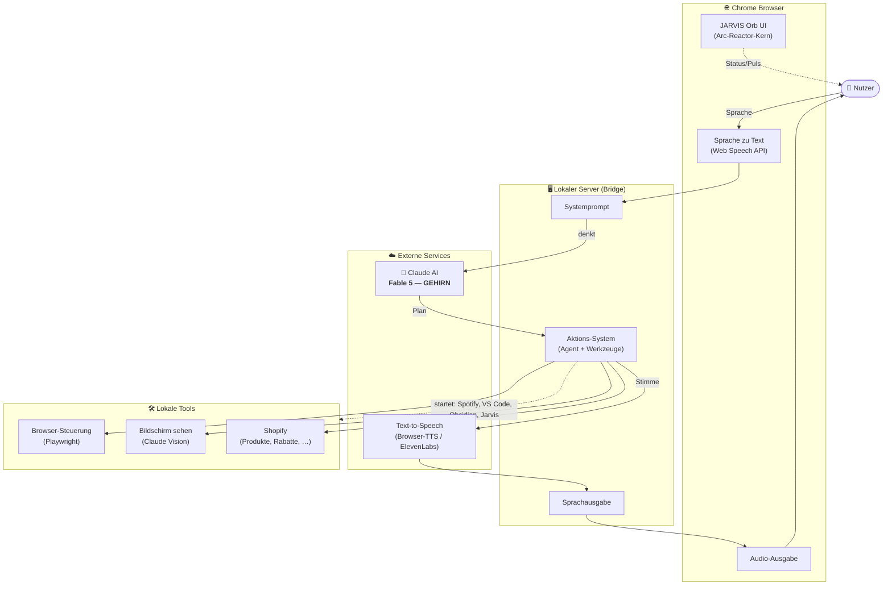

# JARVIS — Systemarchitektur

> Persönlicher KI-Assistent mit Sprachsteuerung.
> **Das Gehirn ist Fable 5** (`claude-fable-5`) — nicht Haiku.

Diese Architektur bildet den Weg **Nutzer → Sprache → Denken → Handeln → Antwort** ab.
Sie entspricht dem Aufbau, den wir in diesem Repo tatsächlich gebaut haben.



## Komponenten — und was im Repo dahinter steckt

| Baustein (Diagramm) | Rolle | Umsetzung in diesem Repo |
|---|---|---|
| **Chrome Browser** | Ein-/Ausgabe beim Nutzer | `dashboard/jarvis_command_center.html` |
| Sprache zu Text | Spracheingabe | Web-Speech-API (de-DE, STT) im HUD |
| JARVIS Orb UI | visuelles Zentrum | Arc-Reactor-Kern (HUD + Live-Ticker) |
| Audio-Ausgabe | hörbare Antwort | `speechSynthesis` (Browser-TTS) |
| **Lokaler Server** | Vermittler & Ausführung | `open_jarvis/agent/server.py` (`--serve`, nur localhost) |
| Systemprompt | Auftrag ans Gehirn | Planer-Prompt in `agent/planner.py` |
| Aktions-System | führt Befehle aus | `JarvisAgent` + Werkzeug-Registry (`agent/tools.py`) |
| **Externe Services** | Denken & Stimme | — |
| 🧠 **Claude AI — Fable 5** | **das Gehirn** (denkt, plant, entscheidet) | `agent/models.py` → `BRAIN_MODEL_KEY = "fable-5"`, `agent/claude_provider.py` |
| Text-to-Speech | Sprachausgabe | Browser-TTS (ElevenLabs optional nachrüstbar) |
| **Lokale Tools** | Wirkung in der Welt | — |
| Browser-Steuerung | Web bedienen | vorbereitet (Playwright ist im Setup vorhanden) |
| Bildschirm sehen | Screenshots verstehen | Claude Vision (nachrüstbar) |
| Shopify | echter Store | `agent/shopify_client.py` (voll angebunden) |

## Warum Fable 5 das Gehirn ist (und nicht Haiku)

- **Fable 5** ist im Modell-Register als **Standard** und **Gehirn** gesetzt:
  `agent/models.py` → `DEFAULT_MODEL_KEY = "fable-5"`, `BRAIN_MODEL_KEY = "fable-5"`.
- Haiku bleibt **auswählbar** (schnell/günstig für einfache Befehle), ist aber
  **nicht** das Standard-Gehirn.
- Prüfbar:

```bash
cd jarvis
python3 -c "from open_jarvis.agent.models import brain_model; print('Gehirn:', brain_model().label, brain_model().model_id)"
# -> Gehirn: Fable 5 claude-fable-5
python3 -m open_jarvis.agent --list-models        # Fable 5 ist mit ★ markiert
```

> **Ehrlich:** Für das Denken mit Fable 5 wird ein `ANTHROPIC_API_KEY` benötigt.
> Ohne Schlüssel plant JARVIS lokal weiter (keyless) — das Gehirn ist dann der
> deterministische lokale Planer, bleibt aber jederzeit auf Fable 5 umschaltbar.

## Datenfluss in einem Satz

Nutzer spricht → **Sprache-zu-Text** → **Systemprompt** → **Fable 5 denkt** →
**Aktions-System** führt Werkzeuge aus → **Text-to-Speech** → JARVIS antwortet hörbar.
