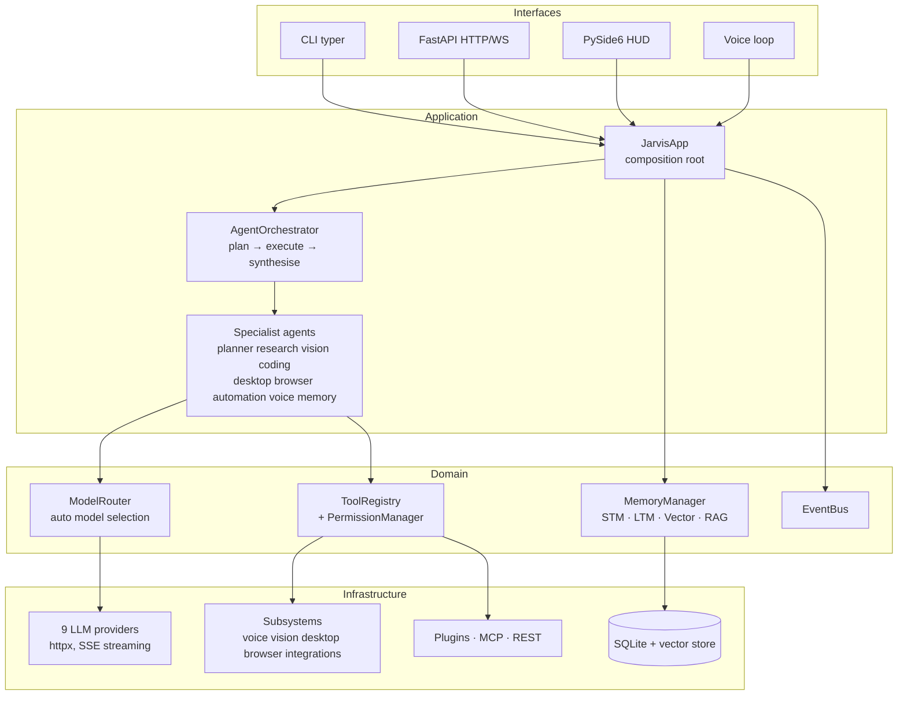

# Architecture

JARVIS follows Clean Architecture: a dependency-free core domain, explicit
composition at the edges, and optional subsystems that plug into stable
contracts. Everything flows through four core abstractions: **config**,
**events**, **tools** and the **model router**.

## Layer map

## Core packages

| Package | Responsibility |
|---|---|
| `jarvis.core` | Configuration (pydantic-settings, layered YAML+env), DI container, async event bus, security (permissions, audit, sandbox), logging, error hierarchy |
| `jarvis.llm` | Neutral chat schema (`Message`, `ToolSpec`, `StreamChunk`), provider implementations, registry, router |
| `jarvis.memory` | Short-term window, SQLite long-term store (FTS5), vector store abstraction, RAG pipeline, `MemoryManager` façade |
| `jarvis.agents` | `Tool`/`ToolRegistry`, `BaseAgent` tool loop, `AgentGraph` state machine, specialists, orchestrator |
| `jarvis.plugins` | Python plugin loader with hot reload, MCP client (stdio+HTTP), REST descriptor loader |
| `jarvis.api` | FastAPI server: REST, SSE streaming, WebSocket, auth |
| `jarvis.app` | `JarvisApp` — the composition root that wires everything |

## Key design decisions

**Providers over SDKs.** All nine LLM backends are implemented directly over
`httpx` against public wire protocols (OpenAI chat-completions, Anthropic
Messages, Gemini generateContent). One `OpenAICompatProvider` powers OpenAI,
OpenRouter, DeepSeek, Mistral, Ollama, LM Studio and generic local servers.
This removes six SDK dependencies, keeps streaming/tool-calling behaviour
uniform and makes every provider testable with mocked transports.

**Automatic model selection.** `ModelRouter.select()` scores every model of
every *healthy* provider against `TaskRequirements` (vision, tools, context
size, cost ceiling, local preference) — quality first, cost as tie-breaker,
strong bonus for local models when `prefer_local` is set. Pinning
`llm.default_provider` bypasses scoring entirely.

**Tools are the single extension surface.** Desktop, browser, vision, voice,
integrations, plugins and MCP servers all register `Tool`s with *tags* and an
optional security *capability*. Agents select their toolset by tag — so a new
tool from any source is immediately usable by every matching agent.

**Capability security.** A tool that declares `capability="desktop.terminal"`
triggers the `PermissionManager` before execution: `allow` / `ask` (interactive
confirmer — GUI dialog, terminal prompt, or headless deny) / `deny`, with
prefix wildcards (`desktop.*`), persisted decisions and a JSONL audit log.

**Orchestration as a state graph.** `AgentGraph` is a minimal typed
plan→execute→synthesise engine with conditional edges (LangGraph-style);
`to_langgraph()` exports a real LangGraph when the optional dependency is
installed. The orchestrator degrades gracefully: unusable plan → direct
answer; single result → no synthesis call.

**Optional subsystems, hard contracts.** Each subsystem module exposes
`register(app: JarvisApp) -> None` and imports its heavy dependencies lazily.
Missing dependency = subsystem inactive (logged), never a crash. The same
mechanism keeps the core closed against modification but open for extension.

**Memory is layered.**
1. *Short-term*: bounded message window; evicted turns are archived.
2. *Long-term*: SQLite (aiosqlite) — conversations, facts with FTS5 prefix
   search, profile, tasks.
3. *Vector*: ChromaDB when installed, otherwise a dependency-free cosine store
   with a deterministic hashing embedder (fully offline); provider embeddings
   (OpenAI/Ollama/Gemini/Mistral) when configured.
4. *RAG*: sentence-aware chunking, metadata-filtered retrieval, citation-ready
   context blocks.

## Data flow of one request

1. Interface (CLI/API/GUI/voice) calls `JarvisApp.ask()` / `ask_stream()`.
2. The turn is recorded; `MemoryManager.recall()` builds a context block from
   facts, episodes and profile.
3. Orchestrator path: planner decomposes → specialists run their tool loops →
   synthesis merges. Streaming path: a single JARVIS agent streams deltas.
4. Every tool call passes the permission gate; every step publishes events
   (`agent.tool_call`, `orchestrator.step`, …) consumed by the GUI feed and
   WebSocket clients.
5. The answer is stored in memory and returned/streamed.

## Concurrency model

Everything is asyncio-native. Sync tool handlers run in a worker thread
(`run_in_executor`) so they cannot block the loop. The GUI runs Qt in the main
thread and the entire `JarvisApp` in a background event loop, bridged with
queued signals. MCP stdio servers are child processes with an async reader
task; the sandbox and terminal use `asyncio.subprocess` with hard timeouts.
